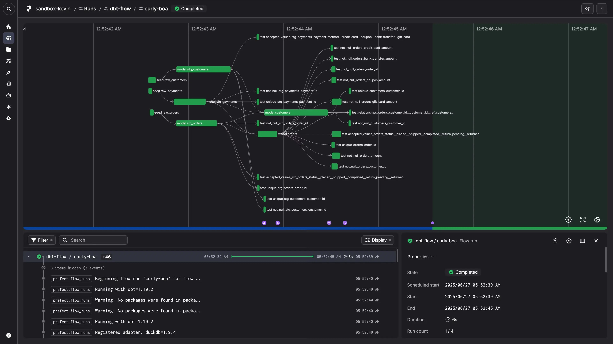
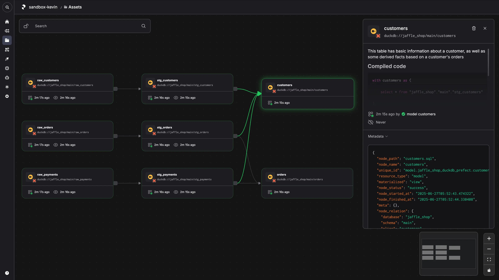

Introduction
===

Running dbt manually gets you started quickly. But eventually you need scheduled runs and proper monitoring. The usual path? Weeks of infrastructure setup, scheduler configuration, and monitoring dashboards.

This tutorial takes a different approach.

You'll deploy your dbt project as a scheduled, monitored pipeline using nothing but a Python script and GitHub. The entire process takes under 5 minutes.

Here's what you'll build:

**Automatic scheduling** and retry logic

**Real-time monitoring** with visual graphs

**Zero infrastructure** to manage

**Git-native deployment** from GitHub

No YAML configuration. No servers to provision. Just working code deployed to production.



This tutorial is based on the blog post [Turn Your dbt Project Into a Production Pipeline in Minutes](https://www.prefect.io/blog/turn-your-dbt-project-into-a-production-pipeline-in-minutes). We'll walk through it step-by-step so you can build it yourself.

Environment Setup
===

First, install the tools you'll need. UV for package management, GitHub CLI for repository management, then dbt, Prefect, and DuckDB.

**Install UV package manager:**

```run
curl -LsSf https://astral.sh/uv/install.sh | sh
export PATH="$HOME/.local/bin:$PATH"
uv --version
```

**Install GitHub CLI:**

```run
sudo apt update && sudo apt install gh -y
gh --version
```

**Create your project environment:**

```run
uv venv dbt-example --python 3.12
. dbt-example/bin/activate
uv pip install "dbt-core==1.10.2" "dbt-duckdb>=1.9.4,<2.0.0" "prefect-dbt>=0.7.0" tzdata
```

**Get your Prefect Cloud API key:**

Open the Prefect Cloud tab. If you don't have a Prefect Cloud account, create one at https://app.prefect.cloud/auth/sign-up

Once logged in, go to **Settings** → **API Keys** and create a new API key. Copy the key.

**Authenticate with Prefect Cloud:**

Run this command, replacing `YOUR_API_KEY` with the key you just copied:

```run
uvx prefect-cloud login --key YOUR_API_KEY
```

This connects your local environment to Prefect Cloud so you can deploy and monitor your pipeline.

**Note**: On your local machine, you can authenticate through your browser instead of using an API key. We're using the API key method here to work around limitations of the sandbox environment.

Creating Your dbt Project
===

Now initialize a new dbt project.

**Initialize your dbt project:**

```run
dbt init --profiles-dir . my_prefect_dbt_project
```

When prompted, select **duckdb** as your database. DuckDB is an embedded analytical database, so you don't need a separate database server.

**Explore your project structure:**

```run
ls -la my_prefect_dbt_project
```

You'll see the standard dbt project structure:

- `models/` - Your SQL transformations
- `tests/` - Data quality tests
- `dbt_project.yml` - Project configuration
- `profiles.yml` - Database connection settings

This is a typical analytics engineering setup. Now let's make it production-ready.

**Fix the default model so it works:**

The default dbt model references a seed that doesn't exist. Let's simplify it:

```run
cd my_prefect_dbt_project
cat > models/example/my_first_dbt_model.sql << 'EOF'
{{
    config(
        materialized='table'
    )
}}

with source_data as (
    select 1 as id
    union all
    select 2 as id
)

select *
from source_data
where id is not null
EOF
cat models/example/my_first_dbt_model.sql
```

This creates a simple model that generates test data directly without needing external seeds.

Adding Prefect Orchestration
===

Here's where things get interesting. Instead of running `dbt build` manually or setting up complex schedulers, you'll wrap your dbt commands in a Prefect flow. Just two files.

**Navigate into your project:**

```run
cd my_prefect_dbt_project
pwd
echo $VIRTUAL_ENV
```

**If your environment isn't active, reactivate it:**

```run
. ../dbt-example/bin/activate
```

**Create requirements file:**

Create `requirements.txt` in the root of your dbt project:

```run
echo "prefect-dbt>=0.7.0" > requirements.txt
echo "dbt-duckdb>=1.9.4,<2.0.0" >> requirements.txt
cat requirements.txt
```

This file tells Prefect Cloud which packages your pipeline needs.

**Create the flow file:**

```run
touch flow.py
ls -la flow.py
```

Now add the Prefect flow code to `flow.py`:

```python
from prefect import flow
from prefect.runtime.flow_run import get_run_count
from prefect_dbt import PrefectDbtRunner

@flow(
    description=(
        "Runs commands dbt deps then dbt build by default. "
        "Runs dbt retry if the flow is retrying."
    ),
    retries=2,
)
def dbt_flow(commands: list[str] | None = None):
    if commands is None:
        commands = ["deps", "build"]

    runner = PrefectDbtRunner(
        include_compiled_code=True,
    )

    if get_run_count() == 1:
        for command in commands:
            runner.invoke(command.split(" "))
    else:
        runner.invoke(["retry"])

if __name__ == "__main__":
    dbt_flow()
```

Here's what this does:

`@flow(retries=2)` tells Prefect to automatically retry the flow up to 2 times if it fails.

`PrefectDbtRunner` gives you native dbt integration with enhanced logging and artifact capture. It automatically locates the dbt project and dbt profile in the current directory.

`get_run_count()` checks if this is a retry. If so, it uses `dbt retry` instead of rerunning everything. This saves time. If a dbt test fails, the retry only reprocesses failed nodes.

`include_compiled_code=True` captures and stores your compiled SQL for debugging.

**Test your setup locally:**

Make sure you're in the dbt project directory and your environment is active:

```run
cd my_prefect_dbt_project
pwd
echo $VIRTUAL_ENV
```

If your environment isn't active, reactivate it:

```run
. ../dbt-example/bin/activate
```

Now test your flow:

```run
uv run flow.py
```

You'll see Prefect executing your dbt commands with detailed logging. If you're logged into Prefect Cloud, you'll also see the flow run appear there along with its corresponding assets.



Push to GitHub
===

Modern data pipelines are deployed from version control. Get your project on GitHub so Prefect Cloud can deploy it.

**Verify you're in the project directory:**

```run
pwd
ls -la flow.py requirements.txt
```

You should see both `flow.py` and `requirements.txt` in the current directory.

**Configure git (replace YOUR_GITHUB_USERNAME with your GitHub username):**

```run
git config --global user.email "YOUR_GITHUB_USERNAME@users.noreply.github.com"
git config --global user.name "YOUR_GITHUB_USERNAME"
```

**Initialize git and create your first commit:**

```run
git init
git add .
git status
git commit -m "Initial commit: prefect dbt project created"
```

**Authenticate with GitHub and create your repository:**

```run
gh auth login
```

**Rename branch to main and create repository:**

```run
git branch -M main
gh repo create my_prefect_dbt_project --public --source=. --remote=origin --push
```

**Verify your code is on GitHub:**

```run
git remote -v
git log --oneline
git branch
```

Your project is now at `https://github.com/YOUR_USERNAME/my_prefect_dbt_project`. Prefect will deploy directly from this repository. No build servers needed.

When you push changes to GitHub, your pipeline automatically uses the latest code on the next run. Zero deployment friction.

Deploy to Prefect Cloud
===

This is where weeks of infrastructure setup gets replaced by a single command.

**Deploy your dbt project from GitHub:**

Replace `YOUR_GITHUB_USERNAME` with your actual GitHub username:

```run
uvx prefect-cloud deploy flow.py:dbt_flow \
--name dbt_deployment \
--from YOUR_GITHUB_USERNAME/my_prefect_dbt_project \
--with-requirements requirements.txt
```

That's it. Your dbt project is now a production-ready pipeline running in the cloud.

Here's what just happened:

`flow.py:dbt_flow` tells Prefect which flow to deploy.

`--name dbt_deployment` creates a deployment called "dbt_deployment".

`--from YOUR_GITHUB_USERNAME/my_prefect_dbt_project` pulls code directly from your GitHub repository.

`--with-requirements requirements.txt` installs your dbt dependencies automatically.

**Execute your pipeline immediately:**

```run
uvx prefect-cloud run dbt_flow/dbt_deployment
```

Your dbt pipeline is running in the cloud. The command returns a link to view the run.

**Schedule it to run daily at noon:**

```run
uvx prefect-cloud schedule dbt_flow/dbt_deployment "0 12 * * *"
```

This creates a cron-based schedule. You can also schedule runs from the Prefect Cloud UI with natural language like "every weekday at 9am".

Monitoring Your Pipeline
===

Open https://app.prefect.cloud and navigate to **Runs** in the left-hand navigation.

Click on your flow run to see:

**Real-time execution graph** showing each dbt command as it executes

**Detailed logs** from every dbt operation

**dbt artifacts** including compiled SQL, test results, and data lineage

**Automatic retry handling** if anything fails

**Timeline and duration** for each step

**Try running with custom dbt commands:**

```run
uvx prefect-cloud run dbt_flow/dbt_deployment --parameter commands='["deps", "run", "test"]'
```

Watch the execution graph update in real-time. This flexibility lets you run different dbt operations from the same deployment. Perfect for ad-hoc data backfills or testing.

What You've Built
===

You just transformed a local dbt project into a production data pipeline.

Zero infrastructure management. No servers, schedulers, or databases to maintain.

Automatic retries. Built-in resilience for production workloads.

Rich observability. Real-time logs and execution graphs.

Git-native deployment. Changes automatically picked up from your repository.

Flexible scheduling. Run on demand, on schedule, or trigger from external events.

Production-ready from day one. This pattern scales from prototype to enterprise.

The entire process took under 5 minutes:
1. Added Prefect files to dbt project (2 minutes)
2. Pushed to GitHub (1 minute)
3. Deployed to Prefect Cloud (1 minute)
4. Scheduled and monitored (1 minute)

Compare this to traditional approaches requiring weeks of infrastructure setup.

What Makes This Different
===

Traditional dbt deployment requires infrastructure setup, monitoring dashboard configuration, weeks of testing, and ongoing maintenance.

With Prefect, you get realtime logs, live execution graphs, and data lineage. Zero infrastructure to manage. No YAML configurations. No separate monitoring tools.

Just Python code and immediate production capabilities.

Real-World Impact
===

This isn't a demo. It's a production-ready pattern that scales.

**Startup to Enterprise**: Same workflow works for 10 models or 10,000.

**Any Data Warehouse**: Works with Snowflake, BigQuery, Redshift, Postgres.

**Team Collaboration**: Git-based workflow familiar to developers.

**Compliance Ready**: Built-in logging, audit trails, and security.

Next Steps
===

From here, you can explore:

**Event-driven automations** to trigger dbt runs when source data changes

**Production data warehouses** like Snowflake, BigQuery, or Redshift

**Advanced scheduling** with cron schedules, intervals, or custom triggers

**Data quality checks** with notifications and alerts for dbt test failures

**SLA monitoring** to track and alert on pipeline duration and freshness

The modern analytics stack is Python-native, git-deployed, and zero-infrastructure. You just built it.

Additional Resources
===

- [Prefect + dbt Integration Documentation](https://prefecthq.github.io/prefect-dbt/)
- [dbt Core Documentation](https://docs.getdbt.com/)
- [Prefect Deployment Guide](https://docs.prefect.io/concepts/deployments/)
- [Prefect Schedules Documentation](https://docs.prefect.io/concepts/schedules/)
- [Blog: Turn Your dbt Project Into a Production Pipeline](https://www.prefect.io/blog/turn-your-dbt-project-into-a-production-pipeline-in-minutes)
