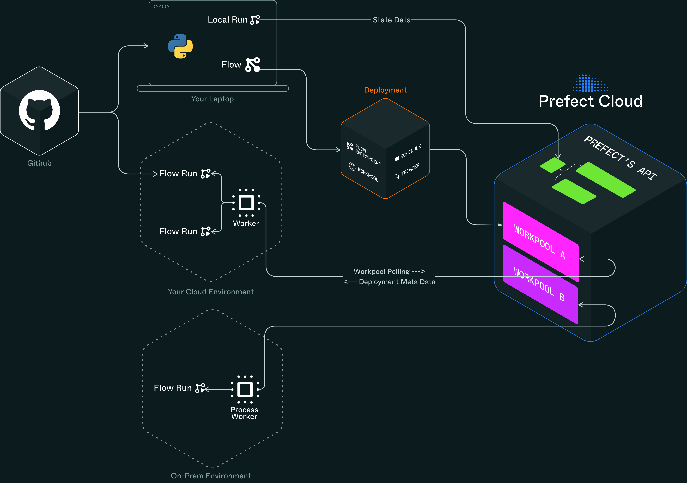

Introduction
===

This is the final module of Prefect Foundations. You'll connect your local environment to Prefect Cloud and learn how to manage different workspaces.

You'll learn:
- **Local workers** - Run flows locally while connected to Prefect Cloud
- **Cloud integration** - See your local runs in the cloud UI
- **Workspaces** - Separate development from production
- **Testing workflows** - Validate before deploying to production

Let's connect local development to cloud orchestration.

Why Local Workers Matter
===

You want to test workflows in Prefect Cloud without deploying to production infrastructure.

When you run workflows locally, you're running a Prefect worker on your machine. It communicates with Prefect Cloud, giving you local development speed with cloud observability.

What this gets you:
- Local runs appear in Prefect Cloud UI
- Test automations and cloud features
- No production deployment needed
- Debug with full observability

Local workers bridge your development environment and Prefect Cloud.



Why Workspaces Matter
===

You don't want test data polluting your production workspace.

Workspaces in Prefect Cloud separate different environments. Have dedicated workspaces for development, testing, and production.

Without separate workspaces:
- Test runs clutter production
- Can't tell development from production
- Security and compliance problems
- Confusing run history

Use dedicated workspaces for each environment. Connect your local worker to the right one.

Let's see this work.

Setup Your Environment
===

First, set up your connection to Prefect Cloud and install dependencies.

We'll use `uv` for package management.

**Install UV package manager:**

```run
curl -LsSf https://astral.sh/uv/install.sh | sh
export PATH="$HOME/.local/bin:$PATH"
uv --version
```

**Set up your project environment:**

Check if you already have a virtual environment from previous challenges:

```run
if [ -d ".venv" ]; then
    echo "Virtual environment already exists, activating..."
    source .venv/bin/activate
else
    echo "Creating new virtual environment..."
    uv venv && source .venv/bin/activate
    uv pip install -U prefect
fi
```

**Install dependencies for this challenge:**

```run
uv pip install requests beautifulsoup4
```

**Get your Prefect Cloud API key:**

Open the Prefect Cloud tab. If you don't have a Prefect Cloud account, create one at https://app.prefect.cloud/auth/sign-up

Once logged in, go to **Settings** → **API Keys** and create a new API key. Copy the key.

**Authenticate with Prefect Cloud:**

Run this command, replacing `YOUR_API_KEY` with the key you just copied:

```run
uvx prefect-cloud login --key YOUR_API_KEY
```

This connects your local environment to Prefect Cloud so you can deploy and monitor your pipeline.

**Note**: On your local machine, you can authenticate through your browser instead of using an API key. We're using the API key method here to work around limitations of the sandbox environment.

Local Worker with Web Scraper
===

Let's run a local worker and connect it to Prefect Cloud using the [simple web scraper example](https://docs.prefect.io/v3/examples/simple-web-scraper).

**Create the web scraper file:**

```run
touch web_scraper.py
```

Add this code to `web_scraper.py`:

```python
from __future__ import annotations

import requests
from bs4 import BeautifulSoup
from prefect import flow, task

@task(retries=3, retry_delay_seconds=2)
def fetch_html(url: str) -> str:
    """Download page HTML (with retries).

    This is just a regular requests call - Prefect adds retry logic
    without changing how we write the code."""
    print(f"Fetching {url} …")
    response = requests.get(url, timeout=10)
    response.raise_for_status()
    return response.text

@task
def parse_article(html: str) -> str:
    """Extract article text, skipping code blocks.

    Regular BeautifulSoup parsing with standard Python string operations.
    Prefect adds observability without changing the logic."""
    soup = BeautifulSoup(html, "html.parser")

    # Find main content - just regular BeautifulSoup
    article = soup.find("article") or soup.find("main")
    if not article:
        return ""

    # Standard Python all the way
    for code in article.find_all(["pre", "code"]):
        code.decompose()

    content = []
    for elem in article.find_all(["h1", "h2", "h3", "p", "ul", "ol", "li"]):
        text = elem.get_text().strip()
        if not text:
            continue

        if elem.name.startswith("h"):
            content.extend(["\n" + "=" * 80, text.upper(), "=" * 80 + "\n"])
        else:
            content.extend([text, ""])

    return "\n".join(content)

@flow(log_prints=True)
def scrape(urls: list[str] | None = None) -> None:
    """Scrape and print article content from URLs.

    A regular Python function that composes our tasks together.
    Prefect adds logging and dependency management automatically."""

    if urls:
        for url in urls:
            content = parse_article(fetch_html(url))
            print(content if content else "No article content found.")

if __name__ == "__main__":
    urls = [
        "https://www.prefect.io/blog/airflow-to-prefect-why-modern-teams-choose-prefect"
    ]
    scrape(urls=urls)
```

This is regular Python code with two decorators that add production features.

**Run the web scraper:**

```run
uv run web_scraper.py
```

**What happened:**

When you ran this script, Prefect:
1. Turned each decorated function into a task/flow run with state tracking
2. Applied retry logic to the network call (flaky connections auto-retry 3 times)
3. Captured all `print()` statements for the UI
4. Sent your local run to Prefect Cloud

No deployment needed. Your local run appears in Prefect Cloud with full observability.

Check your Prefect Cloud UI - the web scraper run is in the Runs section.

Understanding Local Workers
===

When you run workflows locally, you're running a worker process that executes flow runs and communicates with Prefect Cloud.

Let's run a more complex example to see this.

**Create the data pipeline file:**

```run
touch data_pipeline.py
```

Add this code to `data_pipeline.py`:

```python
from prefect import flow, task, get_run_logger
import time
import random

@task(retries=2, retry_delay_seconds=1)
def fetch_data(source: str):
    """Simulate fetching data with potential failures"""
    logger = get_run_logger()
    logger.info(f"Fetching data from {source}")

    # Simulate network delay
    time.sleep(2)

    # Simulate occasional failures
    if random.random() < 0.3:  # 30% chance of failure
        raise Exception(f"Network error fetching from {source}")

    return f"Data from {source}"

@task
def process_data(data: str):
    """Process the fetched data"""
    logger = get_run_logger()
    logger.info(f"Processing: {data}")

    # Simulate processing time
    time.sleep(1)

    return f"Processed {data}"

@task
def save_data(processed_data: str, destination: str):
    """Save processed data"""
    logger = get_run_logger()
    logger.info(f"Saving {processed_data} to {destination}")

    return f"Saved to {destination}"

@flow(name="data-pipeline-{environment}")
def data_pipeline(environment: str = "local"):
    """Data pipeline that demonstrates local worker capabilities"""
    logger = get_run_logger()
    logger.info(f"Starting data pipeline in {environment} environment")

    # Fetch data from multiple sources
    sources = ["API", "Database", "File System"]
    processed_results = []

    for source in sources:
        try:
            data = fetch_data(source)
            processed = process_data(data)
            saved = save_data(processed, f"{environment}_storage")
            processed_results.append(saved)
        except Exception as e:
            logger.error(f"Failed to process {source}: {str(e)}")
            # Continue with other sources

    logger.info(f"Pipeline completed. Processed {len(processed_results)} sources")
    return processed_results

if __name__ == "__main__":
    # Run the pipeline locally
    result = data_pipeline("development")
    print(f"Pipeline result: {result}")
```

**Run it:**

```run
uv run data_pipeline.py
```

**Notice:**
- Failed tasks automatically retry
- All logs appear in terminal and Prefect Cloud
- Each task has clear state (running, completed, failed)
- Failed tasks don't stop the pipeline

Check Prefect Cloud UI. You'll see:
- The flow run with all tasks
- Real-time logs from local execution
- Task retry attempts and failures
- Complete execution timeline

Local workers execute flows and send everything to Prefect Cloud. Test cloud features without deploying.

Workspaces and Environment Management
===

Workspaces in Prefect Cloud are isolated environments. Organize flows, runs, and team members separately for:
- Development
- Testing
- Production
- Different teams or projects

Let's build a workflow that adapts based on workspace.

**Create the workspace-aware pipeline file:**

```run
touch workspace_aware_pipeline.py
```

Add this code to `workspace_aware_pipeline.py`:

```python
from prefect import flow, task, get_run_logger
from prefect import runtime
import requests
import json
from datetime import datetime

@task
def fetch_environment_config():
    """Fetch configuration based on current workspace"""
    logger = get_run_logger()

    # Access runtime information to determine environment
    deployment_name = runtime.deployment.name if runtime.deployment else "local"
    flow_name = runtime.flow_run.name

    # Simulate different configurations based on environment
    if "production" in deployment_name.lower():
        config = {
            "environment": "production",
            "api_url": "https://api.production.com",
            "log_level": "WARNING",
            "retry_attempts": 5,
            "timeout": 30
        }
    elif "staging" in deployment_name.lower():
        config = {
            "environment": "staging",
            "api_url": "https://api.staging.com",
            "log_level": "INFO",
            "retry_attempts": 3,
            "timeout": 15
        }
    else:
        config = {
            "environment": "development",
            "api_url": "https://jsonplaceholder.typicode.com",  # Test API
            "log_level": "DEBUG",
            "retry_attempts": 1,
            "timeout": 5
        }

    logger.info(f"Using {config['environment']} configuration")
    return config

@task
def fetch_data_with_config(config: dict):
    """Fetch data using environment-specific configuration"""
    logger = get_run_logger()

    logger.info(f"Fetching data from {config['api_url']}")
    logger.info(f"Using {config['log_level']} logging level")

    # Simulate API call with environment-specific timeout
    response = requests.get(f"{config['api_url']}/posts", timeout=config['timeout'])
    response.raise_for_status()

    data = response.json()
    logger.info(f"Fetched {len(data)} items from {config['environment']} environment")

    return data

@task
def process_data_with_config(data: list, config: dict):
    """Process data with environment-specific logic"""
    logger = get_run_logger()

    # Different processing based on environment
    if config['environment'] == 'production':
        # Production: full processing with validation
        processed = []
        for item in data[:10]:  # Limit for demo
            processed.append({
                "id": item["id"],
                "title": item["title"],
                "body": item["body"][:100],
                "environment": config['environment'],
                "processed_at": datetime.now().isoformat()
            })
        logger.info(f"Production processing: {len(processed)} items with full validation")

    elif config['environment'] == 'staging':
        # Staging: moderate processing
        processed = []
        for item in data[:5]:  # Fewer items for staging
            processed.append({
                "id": item["id"],
                "title": item["title"],
                "environment": config['environment'],
                "processed_at": datetime.now().isoformat()
            })
        logger.info(f"Staging processing: {len(processed)} items with moderate validation")

    else:
        # Development: minimal processing
        processed = []
        for item in data[:3]:  # Minimal items for dev
            processed.append({
                "id": item["id"],
                "title": item["title"][:50],  # Truncated for dev
                "environment": config['environment'],
                "processed_at": datetime.now().isoformat()
            })
        logger.info(f"Development processing: {len(processed)} items with minimal validation")

    return processed

@flow(name="workspace-aware-pipeline-{environment}")
def workspace_aware_pipeline(environment: str = "development"):
    """Pipeline that adapts based on workspace/environment"""
    logger = get_run_logger()
    logger.info(f"Starting workspace-aware pipeline for {environment}")

    # Get environment-specific configuration
    config = fetch_environment_config()

    # Fetch data with environment-specific settings
    data = fetch_data_with_config(config)

    # Process data with environment-specific logic
    processed = process_data_with_config(data, config)

    # Log summary
    logger.info(f"Pipeline completed in {config['environment']} environment")
    logger.info(f"Processed {len(processed)} items with {config['retry_attempts']} retry attempts")

    return {
        "environment": config['environment'],
        "processed_count": len(processed),
        "config": config,
        "results": processed
    }

if __name__ == "__main__":
    # Run in development mode
    result = workspace_aware_pipeline("development")
    print(f"Development pipeline result: {result['environment']} - {result['processed_count']} items")
```

**Run it:**

```run
uv run workspace_aware_pipeline.py
```

**What you see:**
- Workflow detects it's running in development mode
- Uses development-appropriate settings
- Adjusts logging based on environment
- Different processing logic per environment

**Workspace best practices:**
- **Development** - Local testing and development
- **Staging** - Testing before production
- **Production** - Live workflows only
- **Team workspaces** - Separate by team

Workspaces provide isolation. Workflows adapt based on environment. This keeps test data out of production.

What You've Built
===

You've completed Prefect Foundations and connected local development with cloud orchestration:

- **Local Workers** - Run flows locally with cloud observability
- **Cloud Integration** - Local runs appear in Prefect Cloud
- **Workspace Management** - Separate environments properly
- **Testing** - Validate workflows before production
- **Production path** - Understand local to production flow

You have a foundation in Prefect. You're ready for deployments, work pools, and enterprise features.

Next Steps
===

Ready for advanced topics:

**Deployments & Scheduling**:
- Create production deployments
- Schedule workflows automatically
- Manage deployment environments

**Work Pools & Infrastructure**:
- Configure work pools for compute resources
- Run on Kubernetes, Docker, or cloud
- Scale for high-throughput

**Enterprise Features**:
- Security and compliance
- Team collaboration and RBAC
- Custom integrations

You've got the foundations. Build production workflows.

Additional Resources
===

- [Prefect Cloud Documentation](https://docs.prefect.io/cloud/)
- [Prefect Workers Guide](https://docs.prefect.io/concepts/workers/)
- [Prefect Workspaces](https://docs.prefect.io/cloud/workspaces/)
- [Simple Web Scraper Example](https://docs.prefect.io/v3/examples/simple-web-scraper)
- [Prefect Deployments](https://docs.prefect.io/concepts/deployments/)
